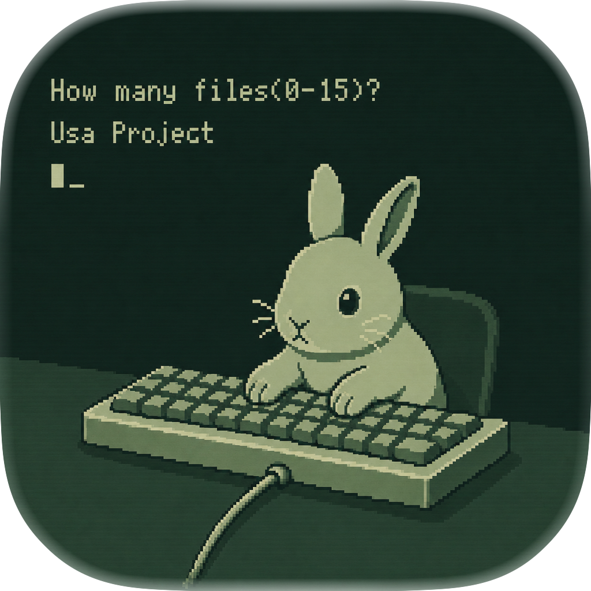
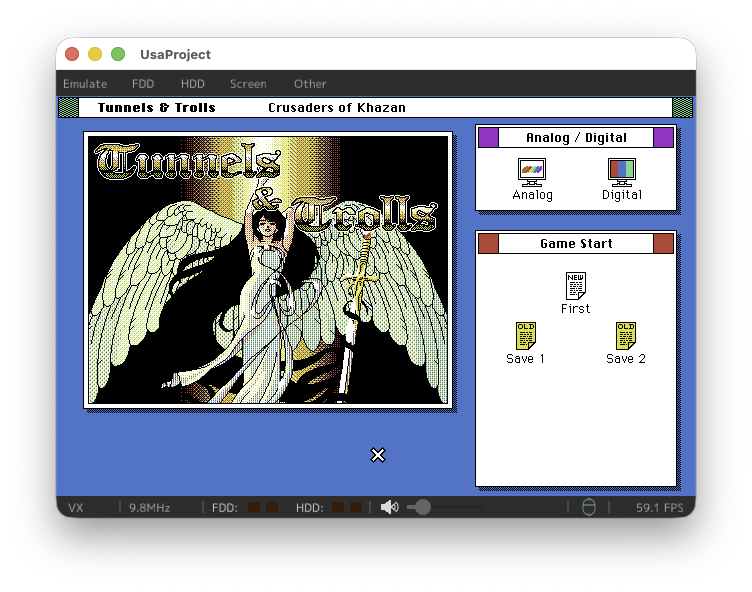
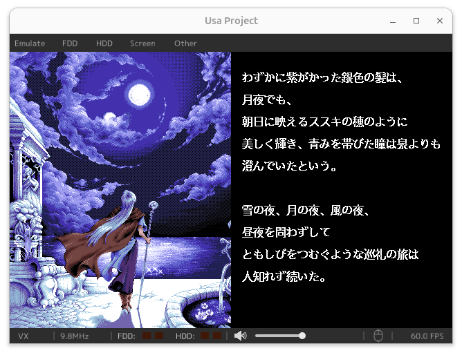
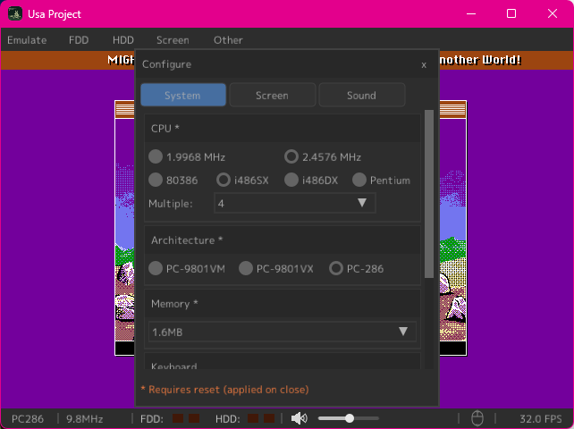

# Usa Project

<p align="center">
  
</p>

<p align="center">
  <a href="https://github.com/bubio/UsaProject/releases/latest">
    
  </a>
  <a href="https://github.com/bubio/UsaProject/blob/main/LICENSE">
    
  </a>
  <a href="https://github.com/bubio/UsaProject/releases/latest">
    
  </a>
</p>

A PC-98 emulator frontend rebuilt with **Zig** and **sokol**, powered by the **NP2kai** core. 
This project aims to provide a lightweight, modern, and cross-platform PC-98 experience.

<p align="center">
  
  
  
</p>

## Features

*   **NP2kai Core**: High-compatibility PC-98 emulation.
*   **Modern Graphics**: Rendered using `sokol_gfx` and `sokol_gl` for a fast and clean UI.
*   **Cross-Platform**: Native support for macOS, Linux, and Windows.
*   **Lightweight**: Built with Zig for minimal overhead and easy distribution.

## Supported OS

*   **macOS**: macOS 13 Ventura or later (Apple Silicon & Intel)
*   **Linux**: Modern distributions (Ubuntu 22.04+ recommended)
*   **Windows**: Windows 11 or later

## License

UsaProject is released under the [MIT License](LICENSE).

It also incorporates several open-source components:

*   **NP2kai**: MIT License (AZO)
*   **Zig**: MIT License
*   **sokol**: zlib/libpng License
*   **nativefiledialog-extended**: Zlib License
*   **M PLUS 1p**: SIL Open Font License 1.1 — Copyright 2016 The M+ Project Authors ([OFL.txt](assets/fonts/OFL.txt))

## Build

### Prerequisites

*   [Zig 0.16.0-dev](https://ziglang.org/download/) or later.

### macOS

To create a standalone `.app` bundle with the icon:

```bash
zig build bundle -Doptimize=ReleaseFast
```
The output will be in `zig-out/UsaProject.app`.

>
> **Option 1: Remove the quarantine flag via Terminal**
> ```bash
> xattr -cr /Applications/UsaProject.app
> ```
>
> **Option 2: Allow via System Settings**
> 1. Attempt to open the app and let it get blocked
> 2. Open **System Settings** → **Privacy & Security**
> 3. Click **"Open Anyway"** next to the message about UsaProject being blocked
  

### Linux

```bash
# Required packages (Ubuntu / Debian)
sudo apt-get install -y \
  libasound2-dev libdbus-1-dev libx11-dev libxi-dev libxcursor-dev libgl-dev

zig build -Doptimize=ReleaseFast
```

### Windows

```powershell
zig build -Doptimize=ReleaseFast
```
